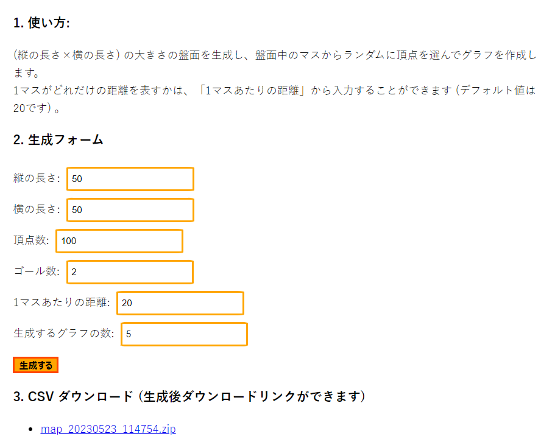
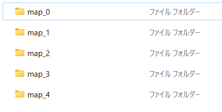
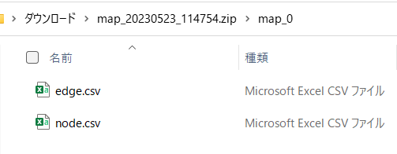
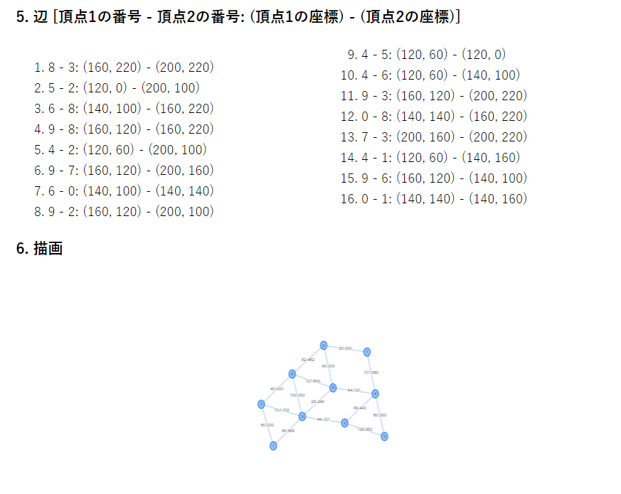

# graph-create
## URL
- [https://yukihira-pot.github.io/graph-create/](https://yukihira-pot.github.io/graph-create/) にデプロイしています。

## Contents
- 2次元の盤面にランダムに頂点を配置し、ランダムに辺を張って平面的グラフを作成するツールです。作成したグラフの頂点や辺の情報は、CSV ファイルとしてダウンロードすることができます。

## Usage
1. 生成フォームに各種の数値を入れ、生成ボタンを押します。ダウンロードリンクをクリックすると、zip ファイルがダウンロードされます。

  - zip ファイルの中には、フォームの「生成するグラフの数」分だけグラフが生成されています。map_(数字) の各フォルダの中には、頂点と辺の情報が格納された CSV ファイルが入っています。 
  
   

2. 生成したグラフはビジュアライズされます。

## To Do
- ランダムなグラフだけでなく、頂点位置や辺の張り方をある程度指定できるようにします。
  - 木 ($n$ 頂点 $n-1$ 辺) に近いグラフ
    - スターグラフに近いグラフ
  - 碁盤目状のグラフ